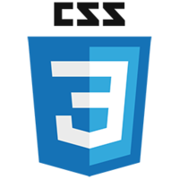
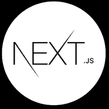
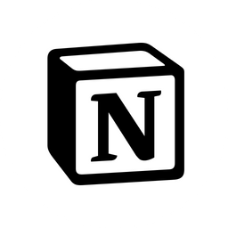
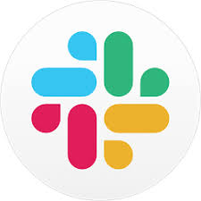

### Hi there 👋
I'm `an expert for front-end` who is - 
- **CREATIVE** with **PASSION**
- in **CONTINUOUS GROWTH** until the age of sixty-five or more than that.  
- has **STRONG RESPONSIBILITY** of doing whatever to do.

 

### MBTI - `INTJ-A`
- Architect Personality
- A Thirst for Knowledge
- A Pioneering Spirit

 

### Skill Set 👍

 &nbsp;
 &nbsp;
 &nbsp;
 &nbsp;
 &nbsp;
 &nbsp;
 &nbsp;
 &nbsp; 
 &nbsp;
 &nbsp;
 &nbsp;
 &nbsp;  
- web standard
- responsive web
- cross-browsing

### Knowledge	🕶
 &nbsp;
 &nbsp;
 &nbsp;
 &nbsp;
 &nbsp;
 &nbsp;
 &nbsp;
 &nbsp;
 &nbsp;
 &nbsp;
 &nbsp;

### Interesting
- ui/ux
- case study
- mobility all around the world
- earth, space, map
- core web technologies

### issue. what my concern today
- I want some evidence for what I've been doing at work. what should I do ? toy project ? blog ? sns ? youtube ? 
- that's so different how good showing my possibility and potential.
- I've been studying english. again & again. in the future I want to write a blog in english for World-Wide front-end developer

<!--
**wendyPop/wendyPop** is a ✨ _special_ ✨ repository because its `README.md` (this file) appears on your GitHub profile.

Here are some ideas to get you started:

- 🌱 I’m currently learning ...
- 👯 I’m looking to collaborate on ...
- 🤔 I’m looking for help with ...
- ⚡ Fun fact: ...

- jira / confluence / 
- AWS / GCP / NCP
- MSA
- IntelliJ / WebStorm
- VSCode
- swaggerAPI
- figma / zeplin

-->
